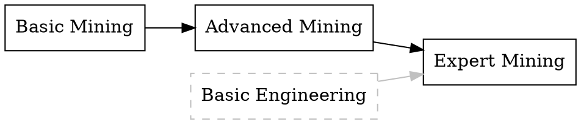

# Skill Tree

Generate Graphviz DOT diagrams showing skill dependency trees from SpaceMolt skills data.

## Overview

The `skill-tree` tool reads `skills.json` from the SpaceMolt game API and generates Graphviz DOT files, one per skill category. Each diagram shows the skill dependencies with a left-to-right flow: root skills on the left, dependent skills on the right.

## Features

- **Category Separation**: Generates one DOT file per skill category
- **Dependency Visualization**: Shows skill prerequisites clearly
- **Cross-Category Links**: Gray edges for dependencies between categories
- **Ordered Layout**: Consistent left-to-right flow
- **Graphviz Compatible**: Standard DOT format for rendering

## Usage

### Basic Usage

```bash
# Generate diagrams from skills.json
go run ./cmd/skill-tree -input skills.json -out ./diagrams

# Or use the built binary
go build -o bin/skill-tree ./cmd/skill-tree
./bin/skill-tree -input skills.json -out ./diagrams
```

### Command-Line Flags

```
-input string
    Path to skills.json file (default "skills.json")

-out string
    Output directory for DOT files (default ".")
```

### Example Session

```bash
$ go run ./cmd/skill-tree -input server_docs/skills.20260216.json -out diagrams

wrote diagrams/combat.dot
wrote diagrams/engineering.dot
wrote diagrams/mining.dot
wrote diagrams/trading.dot
wrote diagrams/piloting.dot

Generated 5 DOT files in diagrams
Convert to SVG: dot -Tsvg -o Engineering.svg engineering.dot
```

## Rendering Diagrams

### Install Graphviz

```bash
# macOS
brew install graphviz

# Debian/Ubuntu
sudo apt-get install graphviz

# Fedora/RHEL
sudo dnf install graphviz
```

### Convert DOT to SVG

```bash
# Convert a single diagram
dot -Tsvg -o Engineering.svg diagrams/engineering.dot

# Convert all diagrams
for f in diagrams/*.dot; do
    dot -Tsvg -o "${f%.dot}.svg" "$f"
done
```

### Convert DOT to PNG

```bash
# Convert a single diagram
dot -Tpng -o Engineering.png diagrams/engineering.dot

# Convert all diagrams
for f in diagrams/*.dot; do
    dot -Tpng -o "${f%.dot}.png" "$f"
done
```

### Other Output Formats

Graphviz supports many formats:
- `-Tsvg` - Scalable Vector Graphics (recommended)
- `-Tpng` - Portable Network Graphics
- `-Tpdf` - Portable Document Format
- `-Tps` - PostScript

## Diagram Structure

### Layout

```
┌─────────────────────────────────────────────────────────┐
│  Category Name (Engineering, Mining, etc.)              │
├─────────────────────────────────────────────────────────┤
│                                                          │
│  [Root Skills] → [Intermediate] → [Advanced]           │
│                                                          │
│  Basic Eng.    →  Adv. Eng.   →  Expert Eng.          │
│       │               │                │                │
│       └───────────────┴────────────────┘                │
│       (dependencies shown as edges)                     │
│                                                          │
└─────────────────────────────────────────────────────────┘
```

### Edge Colors

- **Black edges**: Dependencies within the same category
- **Gray edges**: Dependencies from other categories

### Node Labels

Each skill node shows:
- Skill name (truncated if too long)
- Skill ID (in tooltip, if rendered as SVG)

## Example Diagram

### Input: skills.json

```json
{
  "skills": [
    {
      "id": "basic_mining",
      "name": "Basic Mining",
      "category": "mining",
      "requires": []
    },
    {
      "id": "advanced_mining",
      "name": "Advanced Mining",
      "category": "mining",
      "requires": ["basic_mining"]
    },
    {
      "id": "expert_mining",
      "name": "Expert Mining",
      "category": "mining",
      "requires": ["advanced_mining", "basic_engineering"]
    }
  ]
}
```

### Output: diagrams/mining.dot



## Skill Categories

Common categories include:

- **Combat**: Weapon and combat skills
- **Engineering**: Crafting and repair skills
- **Mining**: Resource extraction skills
- **Trading**: Commerce and negotiation skills
- **Piloting**: Ship handling and navigation skills

## Building

```bash
# Build the binary
go build -o bin/skill-tree ./cmd/skill-tree

# Run the built binary
./bin/skill-tree -input skills.json -out diagrams
```

## Implementation Details

### Category Ordering

Categories are output in a consistent order:
1. Alphabetically sorted
2. Empty categories skipped

### Graph Building

For each category:
1. Find all skills in the category
2. Create nodes for each skill
3. Add edges for dependencies
4. Add gray edges for cross-category dependencies
5. Emit DOT format with left-to-right layout

### Error Handling

- Invalid JSON: Fatal error with message
- Missing skills: Logged, skipped
- Empty categories: Logged, skipped

## Use Cases

### 1. Game Documentation

Generate skill trees for official game wiki:

```bash
go run ./cmd/skill-tree \
  -input server_docs/skills.json \
  -out docs/diagrams

# Convert to SVG for web
for f in docs/diagrams/*.dot; do
    dot -Tsvg -o "docs/$(basename $f .dot).svg" "$f"
done
```

### 2. Planning Tool

Visualize skill progression for agent development:

```bash
# Generate and view immediately
go run ./cmd/skill-tree -input skills.json -out /tmp/skill-tree
dot -Tsvg /tmp/skill-tree/mining.dot | display
```

### 3. Data Validation

Verify skill data integrity:

```bash
# Generate and check for errors
go run ./cmd/skill-tree -input skills.json -out /tmp/test
# Check log output for missing skills or circular dependencies
```

## Troubleshooting

### Issue: "skill not found" in dependencies

**Cause**: A skill references a prerequisite that doesn't exist in the JSON.

**Solution**: Verify all `requires` fields reference valid skill IDs.

### Issue: Diagram too large/complex

**Solution**: Filter by category manually or use Graphviz clustering:

```bash
# Extract single category from JSON
jq '{skills: [.skills[] | select(.category == "mining")]}' \
  skills.json > mining-only.json

# Generate diagram
go run ./cmd/skill-tree -input mining-only.json -out diagrams
```

### Issue: Overlapping nodes

**Solution**: Adjust Graphviz layout parameters:

```bash
dot -Tsvg -Goverlap=scale -Gsplines=true \
  -o output.svg input.dot
```

## Related Tools

- [Graphviz](https://graphviz.org/) - Graph visualization software
- [convert-skills](../convert-skills/) - Convert skill data formats
- [view-learning](../view-learning/) - View agent learning progress

## License

Part of the SpaceMolt project.
