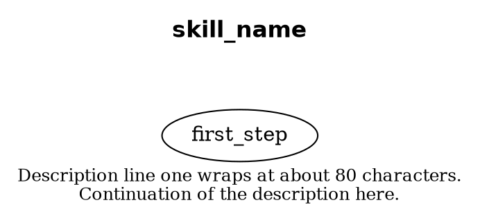

# Skills System

Skills are declarative state machine definitions that describe reusable agent behaviors. Each skill is defined as a YAML file containing a sequence of steps with conditions, actions, and transitions.

Skills are compiled into executable state machines at runtime and can be composed — one skill can invoke another (e.g., `recall` invokes `travel`).

See [SKILLS.md](SKILLS.md) for a complete list of all available skills with summaries and flowchart diagrams.

## File Structure

Each skill consists of three files:

| File | Purpose |
|------|---------|
| `<name>.yaml` | State machine definition (human-editable) |
| `<name>.dot` | Graphviz DOT source for visualization |
| `<name>.svg` | Rendered SVG diagram of the state machine |

## YAML Format

### Top-Level Keys

```yaml
name: skill_name              # Unique identifier (required)
description: ...               # Human-readable purpose (required)
parameters:                    # Input parameters (optional)
  - name: destination_system
    description: Target system ID
    required: true
prerequisites:                 # Conditions required to start (optional)
  - docked
  - has_cargo
targets:                       # Named POI targets resolved at runtime (optional)
  mining_site:
    poi_type: [asteroid_belt, asteroid_field]
    description: Resource extraction location
outputs:                       # Expected state after completion (optional)
  - docked
steps:                         # State machine steps (required)
  - id: step_name
    ...
```

### Step Types

Each step must have a unique `id` and exactly one of these types:

#### Check Step (decision point)

```yaml
- id: check_fuel
  check: true
  conditions:
    fuel_pct < 0.8: goto refuel
    default: goto done
```

#### Action Step (execute a game command)

```yaml
- id: sell_all
  action: sell
  next: done
```

#### Skill Invocation Step (compose skills)

```yaml
- id: travel_home
  skill: travel
  skill_params:
    destination_system: $capital_system_id
  next: ensure_docked
```

#### Terminal Step (end of skill)

```yaml
- id: done
  terminal: true
```

### Conditional Branching

The `conditions` map supports:

| Syntax | Example |
|--------|---------|
| Comparison operators | `fuel_pct < 0.8`, `cargo_pct > 0.97` |
| Function calls | `at_poi_type(station)`, `has_route_progress()` |
| Boolean logic | `AND`, `OR`, `not` |
| Compound conditions | `docked AND fuel_pct < 1.0` |
| Default fallthrough | `default: goto step_id` |

### Repeat Loops

Action steps can loop with a `repeat` block:

```yaml
- id: mine_loop
  action: mine
  repeat:
    while:
      - cargo_pct < 0.97
      - fuel_pct > 0.1
  next: return_to_station
```

All `while` conditions must remain true for the loop to continue.

### Variable References

Parameters and targets are referenced with `$` prefix:

```yaml
target: $mining_site          # References a named target
target: $destination_system   # References a parameter
```

## Visualization

### DOT File Structure

Each DOT file uses a split title/description layout:

- **Title** — A bold, 16pt label at the top of the graph rendered via an invisible `title` node
- **Description** — A 12pt label at the bottom of the graph using the graph-level `label` with `labelloc=b`

Description text should wrap at ~80 characters using `<br/>` tags (HTML label syntax).



### Node Shape Conventions

| Element | Shape | Represents |
|---------|-------|------------|
| Title | `shape=none` (invisible node) | Skill name at top of graph |
| Check step | Diamond | Decision point with branching |
| Action step | Rectangle | Game command execution |
| Terminal step | Double circle | Skill completion |
| Labeled edge | Arrow with text | Conditional transition |
| Unlabeled edge | Arrow | Unconditional `next` transition |
| Dashed edge | Dashed arrow | Repeat loop (step to itself) |

### Generating SVGs

To regenerate an SVG from a DOT file:

```bash
dot -Tsvg <name>.dot -o <name>.svg
```

To regenerate all SVGs:

```bash
for f in *.dot; do dot -Tsvg "$f" -o "${f%.dot}.svg"; done
```

## Adding a New Skill

1. **Create `<name>.yaml`** following the format above. Start with prerequisites, define steps as a state machine, and end with a terminal step.

2. **Create `<name>.dot`** with the Graphviz representation. Use the shape conventions above for consistency.

3. **Generate `<name>.svg`** from the DOT file.

4. **Add the skill entry** to `SKILLS.md` in alphabetical order.

5. **Implement the runtime handler** — ensure any new `action` values used in steps are supported by the skill executor in the Go codebase.

## Common Patterns

| Pattern | Example Skills | Description |
|---------|---------------|-------------|
| Guard-Action-Done | `sell`, `deposit_cargo` | Check prerequisites, do one action, finish |
| Conditional Cascade | `refuel_repair` | Chain of threshold checks with actions |
| Navigate-Act-Return | `mine` | Undock, travel, loop action, return, dock |
| Skill Composition | `recall` | Invoke another skill as a sub-step |
| Route Persistence | `travel` | Save/resume progress across disconnects |
