# Skills Reference

All available agent skills listed alphabetically.

## Table of Contents

- [assist_deliver](#assist_deliver)
- [collect_station_data](#collect_station_data)
- [craft_items](#craft_items)
- [deposit_cargo](#deposit_cargo)
- [emergency_dock](#emergency_dock)
- [ensure_docked](#ensure_docked)
- [mine](#mine)
- [recall](#recall)
- [refuel_repair](#refuel_repair)
- [scan_for_distress](#scan_for_distress)
- [sell](#sell)
- [travel](#travel)

---

## assist_deliver

Deliver fuel cells or repair kits to a stranded pilot. Given a request (target player, request type, target POI), buy the needed supplies, travel to the POI, confirm the player is nearby, jettison the item, find the wreck ID, notify the player via private chat, then return to station and dock.

**Parameters:** `requester_id`, `requester_name`, `request_type` (fuel|repair), `target_poi`

**Prerequisites:** docked

**Pattern:** Navigate-Act-Return

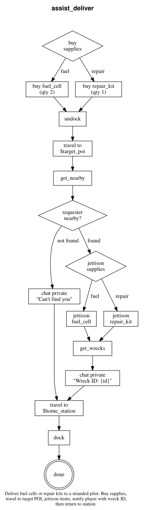

---

## collect_station_data

Collect market listings and ship listings at the current station and store snapshots to the knowledge base. Skips collection if data was already captured today.

**Prerequisites:** docked

**Pattern:** Conditional Cascade

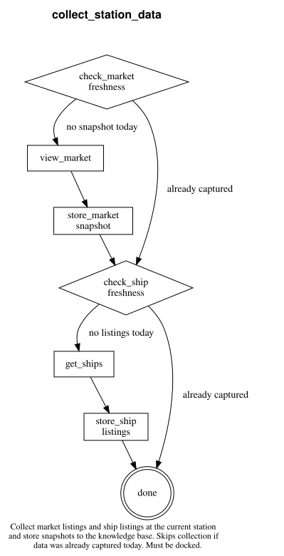

---

## craft_items

Craft all possible items from station storage and ship cargo. Deposits cargo to storage first, queries the crafting MCP server for craftable recipes from the combined pool, withdraws materials, crafts in batches, and deposits results. Repeats until nothing more can be crafted.

**Prerequisites:** docked, at a station

**Pattern:** Guard-Action-Done

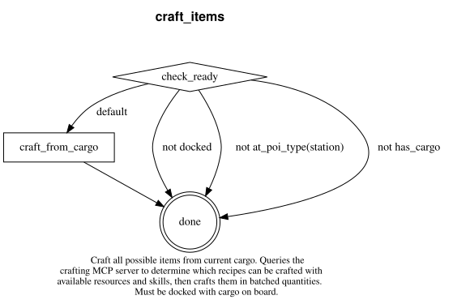

---

## deposit_cargo

Deposit all cargo into station storage. A simple guard-action-done skill that checks docking and cargo status before depositing.

**Prerequisites:** docked, has cargo

**Pattern:** Guard-Action-Done

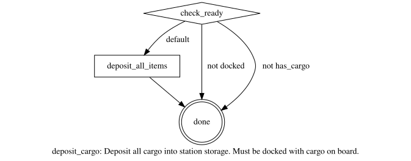

---

## emergency_dock

Check fuel and hull against critical thresholds. If fuel < 30% or hull < 40%, immediately find the nearest station and dock. If already docked or levels are safe, completes with no action. Composes `ensure_docked` and `refuel_repair` skills.

**Prerequisites:** none

**Pattern:** Skill Composition (invokes `ensure_docked`, `refuel_repair`)

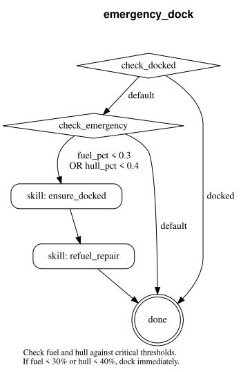

---

## ensure_docked

Find the nearest station in the current system and dock. If already docked, completes immediately. Fetches system data if POIs are not loaded.

**Prerequisites:** none

**Targets:** station (nearest station in current system)

**Pattern:** Guard-Action-Done

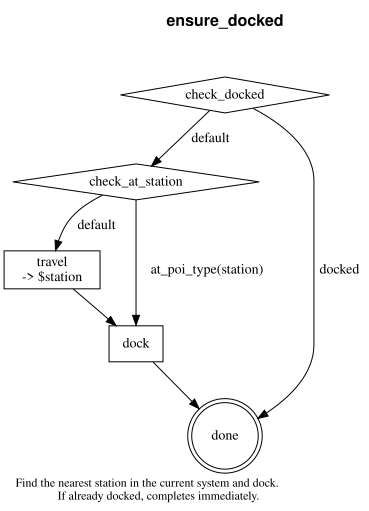

---

## mine

Gather resources from an asteroid belt. Undocks from station, travels to the nearest asteroid belt or field, mines in a loop until cargo is full or fuel is low, returns to station, and docks. Includes emergency docking if fuel runs critically low.

**Prerequisites:** docked or at an asteroid belt/field, has a mining module

**Targets:** mining site (asteroid belt/field), home station

**Pattern:** Navigate-Act-Return

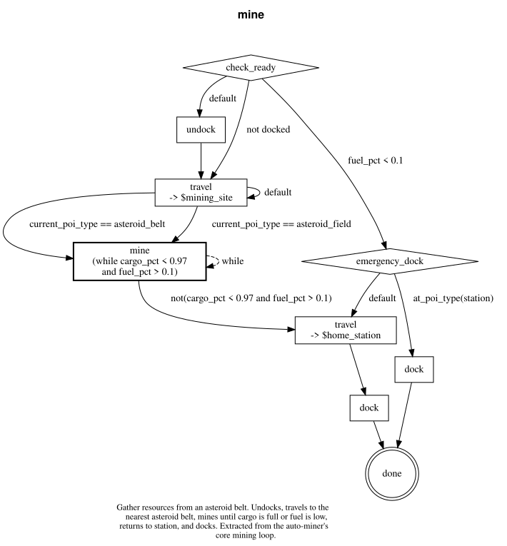

---

## mine_and_deposit

Mine resources from a nearby asteroid belt, return to station, and deposit all cargo into storage. Designed as a background skill that always ends in a docked state.

**Prerequisites:** docked or at an asteroid belt/field, has a mining module

**Targets:** mining site (asteroid belt/field), home station

**Pattern:** Skill Composition (invokes `mine`, `deposit_cargo`)

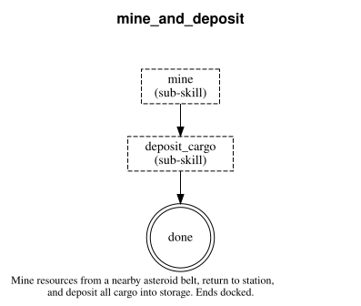

---

## recall

Return the agent to its empire capital system and dock at the home base. Composes the `travel` skill to handle multi-system navigation, then finds and docks at the capital base.

**Prerequisites:** none

**Pattern:** Skill Composition (invokes `travel`)

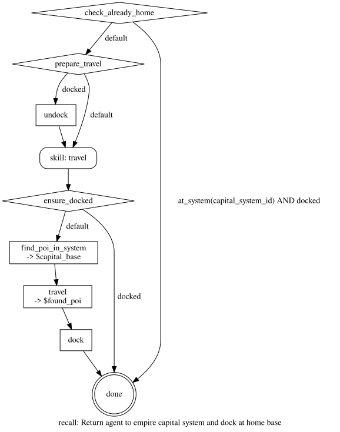

---

## refuel_repair

Refuel and repair the ship at the current station. Checks fuel level against 80% threshold and hull against 90% threshold, performing each action only if needed.

**Prerequisites:** docked

**Pattern:** Conditional Cascade

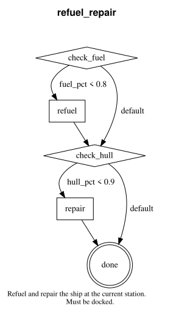

---

## scan_for_distress

Announce shipside assistance availability to the system channel (once per hour), then monitor local, system, and private chat channels for messages requesting fuel or repair assistance. Extract the requester's name/ID and the type of help needed. Outputs request details for assist_deliver to consume.

**Parameters:** `service_name` (rescue service display name from agent personality)

**Prerequisites:** none

**Pattern:** Check-Extract-Done

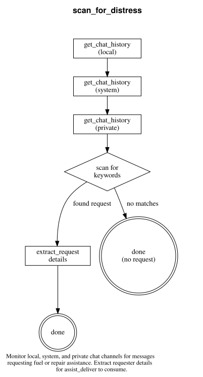

---

## sell

Sell all cargo at the current station. A minimal guard-action-done skill that verifies docking and cargo status before selling.

**Prerequisites:** docked, has cargo

**Pattern:** Guard-Action-Done

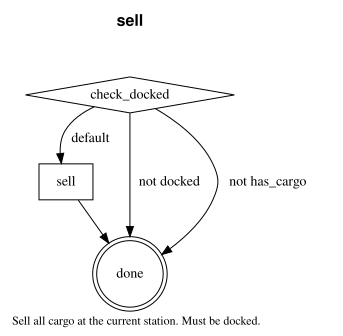

---

## travel

Navigate to a destination system with optional POI docking. Supports disconnect recovery through route persistence — saves progress after each jump and can resume from where it left off. Plans a multi-jump route, refuels if docked, then jumps system by system until arrival.

**Parameters:** `destination_system` (required), `destination_poi` (optional)

**Prerequisites:** at a station/base or undocked

**Pattern:** Route Persistence

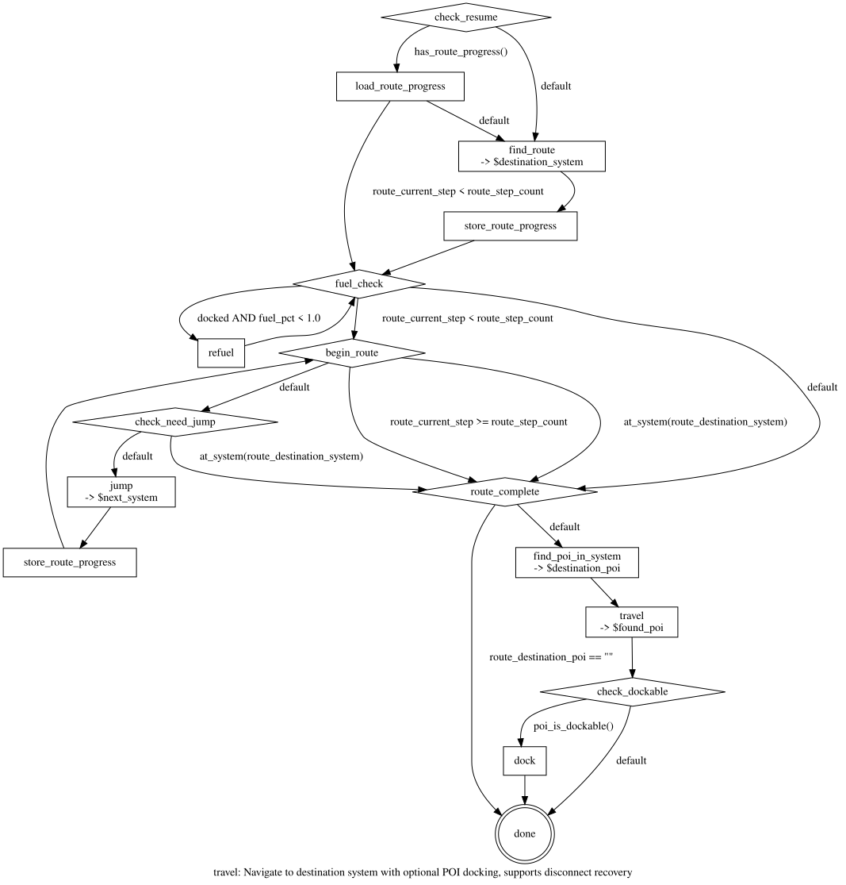
