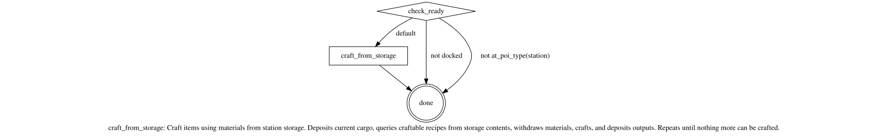

# Skills Reference

All available agent skills listed alphabetically.

## Table of Contents

- [craft_from_storage](#craft_from_storage)
- [craft_items](#craft_items)
- [deposit_cargo](#deposit_cargo)
- [mine](#mine)
- [recall](#recall)
- [refuel_repair](#refuel_repair)
- [sell](#sell)
- [travel](#travel)

---

## craft_from_storage

Craft items using materials from station storage. Deposits current cargo, queries craftable recipes from storage contents, withdraws materials, crafts, and deposits outputs. Repeats until nothing more can be crafted.

**Prerequisites:** docked, at a station

**Pattern:** Guard-Action-Done

---

## craft_items

Craft all possible items from current cargo. Queries the crafting MCP server to determine which recipes can be crafted with available resources and skills, then crafts them in batched quantities. Must be docked with cargo on board.

**Prerequisites:** docked, at a station, has cargo

**Pattern:** Guard-Action-Done

---

## deposit_cargo

Deposit all cargo into station storage. A simple guard-action-done skill that checks docking and cargo status before depositing.

**Prerequisites:** docked, has cargo

**Pattern:** Guard-Action-Done

---

## mine

Gather resources from an asteroid belt. Undocks from station, travels to the nearest asteroid belt or field, mines in a loop until cargo is full or fuel is low, returns to station, and docks. Includes emergency docking if fuel runs critically low.

**Prerequisites:** docked or at an asteroid belt/field, has a mining module

**Targets:** mining site (asteroid belt/field), home station

**Pattern:** Navigate-Act-Return

---

## recall

Return the agent to its empire capital system and dock at the home base. Composes the `travel` skill to handle multi-system navigation, then finds and docks at the capital base.

**Prerequisites:** none

**Pattern:** Skill Composition (invokes `travel`)

---

## refuel_repair

Refuel and repair the ship at the current station. Checks fuel level against 80% threshold and hull against 90% threshold, performing each action only if needed.

**Prerequisites:** docked

**Pattern:** Conditional Cascade

---

## sell

Sell all cargo at the current station. A minimal guard-action-done skill that verifies docking and cargo status before selling.

**Prerequisites:** docked, has cargo

**Pattern:** Guard-Action-Done

---

## travel

Navigate to a destination system with optional POI docking. Supports disconnect recovery through route persistence — saves progress after each jump and can resume from where it left off. Plans a multi-jump route, refuels if docked, then jumps system by system until arrival.

**Parameters:** `destination_system` (required), `destination_poi` (optional)

**Prerequisites:** at a station/base or undocked

**Pattern:** Route Persistence

