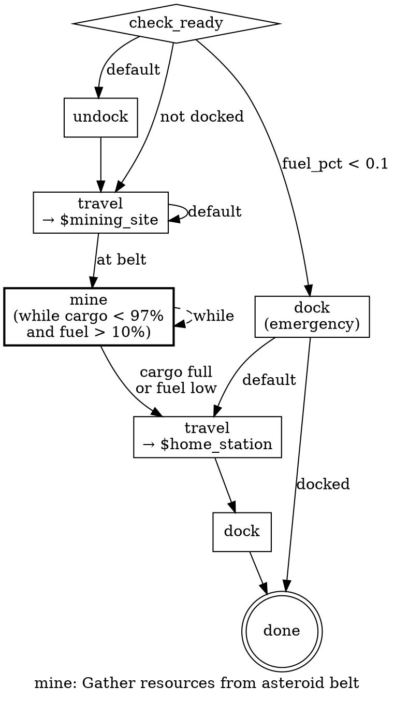

# Composable Skills: State Machine Extraction for LLM Agents

**Date:** 2026-02-27
**Status:** Approved

## Problem

The auto-miner's core mining loop (`pkg/game/mining.go`) encodes a well-tested sequence of game actions (undock, travel, mine, return, dock, sell, refuel, repair). This logic is locked inside Go code and invisible to the LLM agent. When the LLM decides to gather resources, it issues individual atomic actions one per tick with no awareness of the optimal sequence.

## Solution

Extract action sequences into **composable state machine definitions** stored as YAML. Each skill serves two purposes:

1. **LLM prompt documentation** — injected into decision prompts so the LLM understands what a skill does and when to invoke it
2. **Go executor** — reads the YAML and drives execution through the state machine, mapping steps to game client commands

Skills are composable: a step can reference another skill by name, enabling orchestrator skills that chain lower-level skills together.

## Skill Definition Format (YAML)

Skills live in `data/skills/*.yaml`. Each file defines a state machine:

```yaml
name: mine
description: >
  Gather resources from an asteroid belt. Undocks, travels to the nearest
  asteroid belt, mines until cargo is full or fuel is low, returns to station,
  docks, and hands off to the next skill (sell, craft, deposit).

prerequisites:
  - docked OR at_poi_type(asteroid_belt, asteroid_field)
  - has_module_type(mining)

targets:
  mining_site:
    poi_type: [asteroid_belt, asteroid_field]
    description: Resource extraction location
  home_station:
    poi_type: [station]
    description: Nearest station for docking/selling

outputs:
  - cargo_full
  - docked

steps:
  - id: check_ready
    check: true
    conditions:
      fuel_pct < 0.1: goto emergency_dock
      not docked: goto travel_to_belt
      default: goto undock

  - id: undock
    action: undock
    next: travel_to_belt

  - id: travel_to_belt
    action: travel
    target: $mining_site
    conditions:
      current_poi_type == asteroid_belt: goto mine_loop
      current_poi_type == asteroid_field: goto mine_loop
      default: goto travel_to_belt

  - id: mine_loop
    action: mine
    repeat:
      while:
        - cargo_pct < 0.97
        - fuel_pct > 0.1
    next: return_to_station

  - id: return_to_station
    action: travel
    target: $home_station
    next: dock

  - id: dock
    action: dock
    next: done

  - id: emergency_dock
    action: dock
    conditions:
      docked: goto done
      default: goto return_to_station

  - id: done
    terminal: true
```

### Key Elements

- **`targets`** — POI type references resolved at runtime via `$variable` syntax
- **`conditions`** — simple expression DSL evaluated against game state, with `goto` transitions
- **`repeat.while`** — loop conditions (all must be true to continue)
- **`check: true`** — decision node, no game action, just evaluates conditions
- **`terminal: true`** — marks exit points
- **`skill: <name>`** — invokes a sub-skill (composability)

## Composability — Orchestrator Skills

Higher-level skills reference other skills by name:

```yaml
name: trade_run
description: >
  Complete mining-to-profit loop. Mines resources, sells cargo at station,
  refuels and repairs, then checks if upgrades are available before repeating.

targets:
  home_station:
    poi_type: [station]
    description: Base of operations

steps:
  - id: gather_resources
    skill: mine
    next: process_cargo

  - id: process_cargo
    skill: sell
    next: maintain_ship

  - id: maintain_ship
    skill: refuel_repair
    next: check_upgrade

  - id: check_upgrade
    check: true
    conditions:
      credits >= 5000: goto try_upgrade
      default: goto gather_resources

  - id: try_upgrade
    skill: upgrade_ship
    next: gather_resources
```

When the executor hits `skill: mine`, it loads the sub-skill from the registry, runs it to completion, then resumes the parent at the `next` node.

Three tiers emerge:

1. **Primitive actions** — `undock`, `mine`, `travel`, `dock` (single game commands)
2. **Skills** — `mine`, `sell`, `craft` (state machines over primitives)
3. **Orchestrators** — `trade_run`, `combat_patrol` (state machines over skills)

## Expression DSL

The condition evaluator maps named variables to `game.State` fields:

| Variable | Source | Type |
|----------|--------|------|
| `fuel_pct` | `Fuel / MaxFuel` | float |
| `hull_pct` | `Hull / MaxHull` | float |
| `cargo_pct` | `Ship.CargoUsed / Ship.CargoCapacity` | float |
| `cargo_count` | `len(Ship.Cargo)` | int |
| `cargo_full` | `cargo_pct >= 0.97` | bool |
| `fuel_low` | `fuel_pct < 0.1` | bool |
| `credits` | `Credits` | float |
| `docked` | `Doc` | bool |
| `current_poi` | `CurrentPOI` | string |
| `current_poi_type` | resolved from `System.POIs` | string |
| `system_name` | `System.Name` | string |
| `has_cargo` | `len(Ship.Cargo) > 0` | bool |

**Operators:** `<`, `>`, `<=`, `>=`, `==`, `!=`

**Bare booleans:** `docked`, `has_cargo`, `cargo_full`

**Negation:** `not docked`, `not has_cargo`

**Function-style checks:**
- `has_module_type(mining)` — checks if any installed module has this type
- `at_poi_type(asteroid_belt, asteroid_field)` — checks if current POI matches any listed type

## Go Package Structure

```
pkg/skills/
├── skill.go          # Skill, Step, Target, Condition types + YAML loading
├── registry.go       # Registry that loads all skills from data/skills/
├── executor.go       # State machine executor (walks steps, evaluates conditions)
├── expr.go           # Expression DSL parser and evaluator
├── dot.go            # DOT graph generation from skill definitions

cmd/tools/skill-graph/
└── main.go           # CLI: reads YAML, outputs .dot file

data/skills/
├── mine.yaml
├── sell.yaml
├── refuel_repair.yaml
└── trade_run.yaml    # orchestrator referencing mine, sell, etc.
```

### Executor Interface

```go
type Executor struct {
    registry *Registry
    client   *game.Client
    logger   *log.Logger
}

func (e *Executor) Run(ctx context.Context, skillName string) error
func (e *Executor) RunStep(ctx context.Context, skill *Skill, stepID string) (nextStepID string, err error)
```

### Runner Integration

In `pkg/agent/runner.go`'s `executeDecision()`, a new case detects when an action matches a registered skill name and delegates to `skills.Executor.Run()`.

## DOT Graph Generation

The CLI tool reads a skill YAML and produces a DOT digraph.

**Visual conventions:**
- **Diamonds** — decision/check nodes
- **Boxes** — action nodes
- **Bold boxes** — loops (repeat/while)
- **Double circles** — terminal nodes
- **Dashed self-edges** — repeat/while loops
- **Subgraph clusters** — referenced sub-skills (in orchestrators)

**Usage:**

```bash
go run cmd/tools/skill-graph/main.go data/skills/mine.yaml -o mine.dot
dot -Tsvg mine.dot -o mine.svg
```

### Example Output (mine.yaml)


