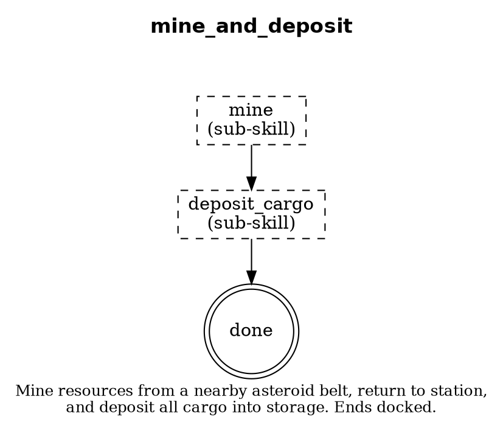

# Concurrent Skills Implementation Plan

> **For Claude:** REQUIRED SUB-SKILL: Use superpowers:executing-plans to implement this plan task-by-task.

**Goal:** Enable agents to run a background skill (e.g., mining) during idle windows of a primary skill (e.g., scan_for_distress), with graceful checkpoint/interrupt on preemption.

**Architecture:** A `CompositeStrategy` in `pkg/strategy/` orchestrates one primary and one background strategy. The skill YAML schema gains a `background_slot` field declaring idle steps. The agent personality config fills the slot with a concrete background skill. The executor uses Go channels and context cancellation for idle signaling and interrupt.

**Tech Stack:** Go 1.24, existing `pkg/strategy/Strategy` interface, `pkg/skills/Skill` YAML parser, `gopkg.in/yaml.v3`

---

### Task 1: Add `BackgroundSlot` to Skill YAML Schema

**Files:**
- Modify: `pkg/skills/skill.go:14-22` (Skill struct)
- Modify: `pkg/skills/skill.go:107-144` (Validate method)
- Test: `pkg/skills/skill_test.go`

**Step 1: Write the failing test**

Add to `pkg/skills/skill_test.go`:

```go
func TestParseSkillWithBackgroundSlot(t *testing.T) {
	yamlData := []byte(`
name: test_with_background
description: A skill that declares a background slot
background_slot:
  description: "Runs during idle windows"
  interrupt: graceful
  cleanup_outputs:
    - docked
  idle_steps:
    - sleep_cycle
  min_idle_duration: 60
steps:
  - id: do_work
    action: mine
    next: sleep_cycle
  - id: sleep_cycle
    action: sleep_scan_interval
    next: done
  - id: done
    terminal: true
`)
	skill, err := ParseSkill(yamlData)
	if err != nil {
		t.Fatalf("ParseSkill failed: %v", err)
	}

	if skill.BackgroundSlot == nil {
		t.Fatal("expected BackgroundSlot to be non-nil")
	}
	if skill.BackgroundSlot.Interrupt != "graceful" {
		t.Errorf("interrupt = %q, want %q", skill.BackgroundSlot.Interrupt, "graceful")
	}
	if len(skill.BackgroundSlot.CleanupOutputs) != 1 || skill.BackgroundSlot.CleanupOutputs[0] != "docked" {
		t.Errorf("cleanup_outputs = %v, want [docked]", skill.BackgroundSlot.CleanupOutputs)
	}
	if len(skill.BackgroundSlot.IdleSteps) != 1 || skill.BackgroundSlot.IdleSteps[0] != "sleep_cycle" {
		t.Errorf("idle_steps = %v, want [sleep_cycle]", skill.BackgroundSlot.IdleSteps)
	}
	if skill.BackgroundSlot.MinIdleDuration != 60 {
		t.Errorf("min_idle_duration = %d, want 60", skill.BackgroundSlot.MinIdleDuration)
	}
}

func TestParseSkillBackgroundSlotValidation(t *testing.T) {
	// Background slot referencing a non-existent idle step should fail validation.
	yamlData := []byte(`
name: bad_background
description: References non-existent idle step
background_slot:
  interrupt: graceful
  idle_steps:
    - nonexistent_step
steps:
  - id: work
    action: mine
    next: done
  - id: done
    terminal: true
`)
	_, err := ParseSkill(yamlData)
	if err == nil {
		t.Fatal("expected validation error for non-existent idle step")
	}
}

func TestParseSkillWithoutBackgroundSlot(t *testing.T) {
	yamlData := []byte(`
name: simple_skill
description: No background slot
steps:
  - id: done
    terminal: true
`)
	skill, err := ParseSkill(yamlData)
	if err != nil {
		t.Fatalf("ParseSkill failed: %v", err)
	}
	if skill.BackgroundSlot != nil {
		t.Fatal("expected BackgroundSlot to be nil for skill without it")
	}
}
```

**Step 2: Run test to verify it fails**

Run: `go test ./pkg/skills/ -run TestParseSkillWithBackgroundSlot -v`
Expected: FAIL — `BackgroundSlot` field does not exist

**Step 3: Write minimal implementation**

In `pkg/skills/skill.go`, add the `BackgroundSlot` type and field:

```go
// BackgroundSlot declares that this skill has idle windows where a background
// skill can run. The agent personality config fills in which skill to use.
type BackgroundSlot struct {
	Description      string   `yaml:"description,omitempty"`
	Interrupt        string   `yaml:"interrupt"`                   // "graceful", "immediate", or "abandon"
	CleanupOutputs   []string `yaml:"cleanup_outputs,omitempty"`   // Required end-state, e.g. ["docked"]
	IdleSteps        []string `yaml:"idle_steps"`                  // Step IDs representing idle time
	MinIdleDuration  int      `yaml:"min_idle_duration,omitempty"` // Seconds; skip background if idle window shorter
}
```

Add field to `Skill` struct:

```go
type Skill struct {
	Name           string                `yaml:"name"`
	Description    string                `yaml:"description"`
	Prerequisites  []string              `yaml:"prerequisites,omitempty"`
	Parameters     []ParameterDefinition `yaml:"parameters,omitempty"`
	Targets        map[string]Target     `yaml:"targets,omitempty"`
	Outputs        []string              `yaml:"outputs,omitempty"`
	BackgroundSlot *BackgroundSlot       `yaml:"background_slot,omitempty"`
	Steps          []Step                `yaml:"steps"`
}
```

In `Validate()`, add validation that idle_steps reference existing step IDs:

```go
// Validate background_slot references.
if s.BackgroundSlot != nil {
	for _, idleStep := range s.BackgroundSlot.IdleSteps {
		if !seen[idleStep] {
			return fmt.Errorf("background_slot.idle_steps references unknown step: %q", idleStep)
		}
	}
	validInterrupts := map[string]bool{"graceful": true, "immediate": true, "abandon": true}
	if s.BackgroundSlot.Interrupt != "" && !validInterrupts[s.BackgroundSlot.Interrupt] {
		return fmt.Errorf("background_slot.interrupt must be one of: graceful, immediate, abandon; got %q", s.BackgroundSlot.Interrupt)
	}
}
```

**Step 4: Run tests to verify they pass**

Run: `go test ./pkg/skills/ -v`
Expected: All PASS

**Step 5: Run linter**

Run: `golangci-lint run ./pkg/skills/...`
Expected: No new findings

**Step 6: Commit**

```bash
git add pkg/skills/skill.go pkg/skills/skill_test.go
git commit -m "feat(skills): add BackgroundSlot to skill YAML schema"
```

---

### Task 2: Add `SkillCheckpoint` Type

**Files:**
- Create: `pkg/strategy/checkpoint.go`
- Test: `pkg/strategy/checkpoint_test.go`

**Step 1: Write the failing test**

Create `pkg/strategy/checkpoint_test.go`:

```go
package strategy

import (
	"testing"
)

func TestCheckpointSaveRestore(t *testing.T) {
	cp := &SkillCheckpoint{
		SkillName:   "mine",
		CurrentStep: "mine_loop",
		StepState: map[string]any{
			"cargo_pct":   0.52,
			"mining_site": "belt-42",
		},
	}

	if cp.SkillName != "mine" {
		t.Errorf("SkillName = %q, want %q", cp.SkillName, "mine")
	}
	if cp.CurrentStep != "mine_loop" {
		t.Errorf("CurrentStep = %q, want %q", cp.CurrentStep, "mine_loop")
	}
	if cp.IsEmpty() {
		t.Error("expected non-empty checkpoint")
	}
}

func TestCheckpointEmpty(t *testing.T) {
	cp := &SkillCheckpoint{}
	if !cp.IsEmpty() {
		t.Error("expected empty checkpoint")
	}
}

func TestCheckpointClear(t *testing.T) {
	cp := &SkillCheckpoint{
		SkillName:   "mine",
		CurrentStep: "mine_loop",
		StepState:   map[string]any{"cargo_pct": 0.5},
	}
	cp.Clear()
	if !cp.IsEmpty() {
		t.Error("expected empty checkpoint after Clear()")
	}
}
```

**Step 2: Run test to verify it fails**

Run: `go test ./pkg/strategy/ -run TestCheckpoint -v`
Expected: FAIL — `SkillCheckpoint` not defined

**Step 3: Write minimal implementation**

Create `pkg/strategy/checkpoint.go`:

```go
package strategy

// SkillCheckpoint captures the state of a background skill that was interrupted,
// allowing it to resume from where it left off.
type SkillCheckpoint struct {
	// SkillName is the name of the interrupted skill (e.g. "mine").
	SkillName string

	// CurrentStep is the step ID where execution was interrupted.
	CurrentStep string

	// StepState holds skill-specific state at the time of interruption
	// (e.g. cargo_pct, mining_site ID).
	StepState map[string]any
}

// IsEmpty returns true if no checkpoint data is stored.
func (c *SkillCheckpoint) IsEmpty() bool {
	return c.SkillName == "" && c.CurrentStep == ""
}

// Clear resets the checkpoint to empty state.
func (c *SkillCheckpoint) Clear() {
	c.SkillName = ""
	c.CurrentStep = ""
	c.StepState = nil
}
```

**Step 4: Run tests to verify they pass**

Run: `go test ./pkg/strategy/ -run TestCheckpoint -v`
Expected: All PASS

**Step 5: Run linter**

Run: `golangci-lint run ./pkg/strategy/...`
Expected: No new findings

**Step 6: Commit**

```bash
git add pkg/strategy/checkpoint.go pkg/strategy/checkpoint_test.go
git commit -m "feat(strategy): add SkillCheckpoint type for background skill state"
```

---

### Task 3: Add `BackgroundRunner` — Interruptible Skill Wrapper

**Files:**
- Create: `pkg/strategy/background.go`
- Test: `pkg/strategy/background_test.go`

**Step 1: Write the failing test**

Create `pkg/strategy/background_test.go`:

```go
package strategy

import (
	"context"
	"sync"
	"testing"
	"time"

	"github.com/rsned/spacemolt/pkg/game"
)

// mockStrategy records calls for testing.
type mockStrategy struct {
	name       string
	runCalled  bool
	runErr     error
	runDelay   time.Duration
	status     string
	mu         sync.Mutex
}

func (m *mockStrategy) Name() string        { return m.name }
func (m *mockStrategy) Description() string { return m.name + " strategy" }
func (m *mockStrategy) CurrentStatus() string {
	m.mu.Lock()
	defer m.mu.Unlock()
	return m.status
}

func (m *mockStrategy) Run(ctx context.Context, client *game.Client, cfg Config) error {
	m.mu.Lock()
	m.runCalled = true
	m.status = "running"
	m.mu.Unlock()

	if m.runDelay > 0 {
		select {
		case <-ctx.Done():
			m.mu.Lock()
			m.status = "interrupted"
			m.mu.Unlock()
			return ctx.Err()
		case <-time.After(m.runDelay):
		}
	}

	m.mu.Lock()
	m.status = "completed"
	m.mu.Unlock()
	return m.runErr
}

func TestBackgroundRunnerStartStop(t *testing.T) {
	mock := &mockStrategy{name: "test-bg", runDelay: 5 * time.Second}
	bgr := NewBackgroundRunner(mock, BackgroundRunnerConfig{
		CleanupTimeout: 2 * time.Second,
	})

	cfg := Config{AgentID: "test-agent"}
	bgr.Start(context.Background(), nil, cfg)

	// Give it a moment to start
	time.Sleep(50 * time.Millisecond)

	if !bgr.IsRunning() {
		t.Error("expected background runner to be running")
	}

	cp := bgr.Interrupt()
	if bgr.IsRunning() {
		t.Error("expected background runner to be stopped after interrupt")
	}

	// Checkpoint should be empty for a strategy that doesn't save state
	_ = cp
}

func TestBackgroundRunnerNaturalCompletion(t *testing.T) {
	mock := &mockStrategy{name: "test-bg", runDelay: 50 * time.Millisecond}
	bgr := NewBackgroundRunner(mock, BackgroundRunnerConfig{
		CleanupTimeout: 2 * time.Second,
	})

	cfg := Config{AgentID: "test-agent"}
	bgr.Start(context.Background(), nil, cfg)

	// Wait for natural completion
	time.Sleep(200 * time.Millisecond)

	if bgr.IsRunning() {
		t.Error("expected background runner to have completed naturally")
	}
}
```

**Step 2: Run test to verify it fails**

Run: `go test ./pkg/strategy/ -run TestBackgroundRunner -v`
Expected: FAIL — `BackgroundRunner` not defined

**Step 3: Write minimal implementation**

Create `pkg/strategy/background.go`:

```go
package strategy

import (
	"context"
	"log"
	"sync"
	"time"

	"github.com/rsned/spacemolt/pkg/game"
)

// BackgroundRunnerConfig configures a BackgroundRunner.
type BackgroundRunnerConfig struct {
	// CleanupTimeout is how long the background skill has to clean up after
	// interrupt before being force-killed.
	CleanupTimeout time.Duration

	// Logger for background runner events. Uses log.Default() if nil.
	Logger *log.Logger
}

// BackgroundRunner wraps a Strategy with interrupt/checkpoint support for
// running as a background skill during idle windows of a primary skill.
type BackgroundRunner struct {
	strategy Strategy
	config   BackgroundRunnerConfig
	logger   *log.Logger

	mu         sync.Mutex
	running    bool
	cancel     context.CancelFunc
	done       chan struct{}
	checkpoint *SkillCheckpoint
}

// NewBackgroundRunner creates a background runner for the given strategy.
func NewBackgroundRunner(strategy Strategy, config BackgroundRunnerConfig) *BackgroundRunner {
	logger := config.Logger
	if logger == nil {
		logger = log.Default()
	}
	return &BackgroundRunner{
		strategy:   strategy,
		config:     config,
		logger:     logger,
		checkpoint: &SkillCheckpoint{},
	}
}

// Start begins executing the background strategy in a goroutine.
// It uses the provided context as a parent — cancelling it also stops the background.
func (b *BackgroundRunner) Start(parent context.Context, client *game.Client, cfg Config) {
	b.mu.Lock()
	defer b.mu.Unlock()

	if b.running {
		return
	}

	ctx, cancel := context.WithCancel(parent)
	b.cancel = cancel
	b.running = true
	b.done = make(chan struct{})

	go func() {
		defer func() {
			b.mu.Lock()
			b.running = false
			b.mu.Unlock()
			close(b.done)
		}()

		b.logger.Printf("[bg:%s] background skill started", b.strategy.Name())
		err := b.strategy.Run(ctx, client, cfg)
		if err != nil && ctx.Err() == nil {
			b.logger.Printf("[bg:%s] background skill error: %v", b.strategy.Name(), err)
		} else if err == nil {
			b.logger.Printf("[bg:%s] background skill completed naturally", b.strategy.Name())
			// Natural completion — clear checkpoint
			b.mu.Lock()
			b.checkpoint.Clear()
			b.mu.Unlock()
		} else {
			b.logger.Printf("[bg:%s] background skill interrupted", b.strategy.Name())
		}
	}()
}

// Interrupt signals the background skill to stop and waits for it to finish
// cleanup within the configured timeout. Returns the current checkpoint.
func (b *BackgroundRunner) Interrupt() *SkillCheckpoint {
	b.mu.Lock()
	if !b.running {
		cp := *b.checkpoint
		b.mu.Unlock()
		return &cp
	}

	cancel := b.cancel
	done := b.done
	b.mu.Unlock()

	// Signal cancellation
	if cancel != nil {
		cancel()
	}

	// Wait for cleanup with timeout
	timeout := b.config.CleanupTimeout
	if timeout == 0 {
		timeout = 2 * time.Minute
	}

	select {
	case <-done:
		b.logger.Printf("[bg:%s] background skill stopped cleanly", b.strategy.Name())
	case <-time.After(timeout):
		b.logger.Printf("[bg:%s] cleanup timeout exceeded, force-stopping", b.strategy.Name())
		b.mu.Lock()
		b.running = false
		b.mu.Unlock()
	}

	b.mu.Lock()
	cp := *b.checkpoint
	b.mu.Unlock()
	return &cp
}

// IsRunning returns whether the background skill is currently executing.
func (b *BackgroundRunner) IsRunning() bool {
	b.mu.Lock()
	defer b.mu.Unlock()
	return b.running
}

// GetCheckpoint returns a copy of the current checkpoint.
func (b *BackgroundRunner) GetCheckpoint() SkillCheckpoint {
	b.mu.Lock()
	defer b.mu.Unlock()
	return *b.checkpoint
}

// SetCheckpoint updates the stored checkpoint (called by the background
// strategy when saving progress).
func (b *BackgroundRunner) SetCheckpoint(cp SkillCheckpoint) {
	b.mu.Lock()
	defer b.mu.Unlock()
	*b.checkpoint = cp
}

// Strategy returns the wrapped strategy.
func (b *BackgroundRunner) Strategy() Strategy {
	return b.strategy
}
```

**Step 4: Run tests to verify they pass**

Run: `go test ./pkg/strategy/ -run TestBackgroundRunner -v`
Expected: All PASS

**Step 5: Run linter**

Run: `golangci-lint run ./pkg/strategy/...`
Expected: No new findings

**Step 6: Commit**

```bash
git add pkg/strategy/background.go pkg/strategy/background_test.go
git commit -m "feat(strategy): add BackgroundRunner with interrupt and checkpoint support"
```

---

### Task 4: Add `CompositeStrategy` — Primary + Background Orchestration

**Files:**
- Create: `pkg/strategy/composite.go`
- Test: `pkg/strategy/composite_test.go`

**Step 1: Write the failing test**

Create `pkg/strategy/composite_test.go`:

```go
package strategy

import (
	"context"
	"log"
	"sync/atomic"
	"testing"
	"time"

	"github.com/rsned/spacemolt/pkg/game"
)

// idleAwareMock simulates a primary strategy that enters idle windows.
type idleAwareMock struct {
	name         string
	idleCallback func(ctx context.Context) // Called when entering idle
	cycles       int
	status       string
}

func (m *idleAwareMock) Name() string        { return m.name }
func (m *idleAwareMock) Description() string { return m.name + " strategy" }
func (m *idleAwareMock) CurrentStatus() string { return m.status }

func (m *idleAwareMock) Run(ctx context.Context, _ *game.Client, _ Config) error {
	for range m.cycles {
		if ctx.Err() != nil {
			return ctx.Err()
		}
		m.status = "active"
		time.Sleep(20 * time.Millisecond) // Simulate active work

		m.status = "idle"
		if m.idleCallback != nil {
			m.idleCallback(ctx)
		}
	}
	return nil
}

func TestCompositeStrategyInterface(t *testing.T) {
	primary := &mockStrategy{name: "primary", runDelay: 50 * time.Millisecond}
	background := &mockStrategy{name: "background", runDelay: 5 * time.Second}

	cs := NewCompositeStrategy(primary, background, CompositeConfig{
		CleanupTimeout: 1 * time.Second,
		Logger:         log.Default(),
	})

	if cs.Name() != "primary+background" {
		t.Errorf("Name() = %q, want %q", cs.Name(), "primary+background")
	}

	// Implements Strategy interface
	var _ Strategy = cs
}

func TestCompositeStrategyRunsBackground(t *testing.T) {
	var bgStarted atomic.Bool
	background := &mockStrategy{name: "bg", runDelay: 5 * time.Second}

	// Track when background actually starts
	originalRun := background.Run
	_ = originalRun
	bgStarted.Store(false)

	primary := &mockStrategy{name: "primary", runDelay: 100 * time.Millisecond}

	cs := NewCompositeStrategy(primary, background, CompositeConfig{
		CleanupTimeout: 1 * time.Second,
		Logger:         log.Default(),
	})

	ctx, cancel := context.WithTimeout(context.Background(), 500*time.Millisecond)
	defer cancel()

	_ = cs.Run(ctx, nil, Config{AgentID: "test"})

	// Primary should have run
	if !primary.runCalled {
		t.Error("expected primary strategy to have run")
	}
}

func TestCompositeStrategyStatus(t *testing.T) {
	primary := &mockStrategy{name: "primary", runDelay: 100 * time.Millisecond}
	background := &mockStrategy{name: "background", runDelay: 5 * time.Second}

	cs := NewCompositeStrategy(primary, background, CompositeConfig{
		CleanupTimeout: 1 * time.Second,
		Logger:         log.Default(),
	})

	status := cs.CurrentStatus()
	if status == "" {
		t.Error("expected non-empty status")
	}
}
```

**Step 2: Run test to verify it fails**

Run: `go test ./pkg/strategy/ -run TestCompositeStrategy -v`
Expected: FAIL — `CompositeStrategy` not defined

**Step 3: Write minimal implementation**

Create `pkg/strategy/composite.go`:

```go
package strategy

import (
	"context"
	"fmt"
	"log"
	"sync"
	"time"

	"github.com/rsned/spacemolt/pkg/game"
)

// CompositeConfig configures a CompositeStrategy.
type CompositeConfig struct {
	// CleanupTimeout is how long the background gets to clean up after interrupt.
	CleanupTimeout time.Duration

	// MinIdleDuration is the minimum idle window (seconds) before starting background.
	// If the idle window is shorter than this, the background is not started.
	MinIdleDuration time.Duration

	// Logger for composite strategy events.
	Logger *log.Logger
}

// CompositeStrategy orchestrates a primary strategy with a background strategy
// that runs during the primary's idle windows. Only one strategy sends commands
// to the game client at a time — access is serialized through the idle enter/exit
// lifecycle.
type CompositeStrategy struct {
	primary    Strategy
	background Strategy
	config     CompositeConfig
	logger     *log.Logger

	bgRunner *BackgroundRunner

	mu     sync.RWMutex
	status string

	// idleCh is used by the primary to signal idle enter/exit.
	// Send true to enter idle, false to exit.
	idleCh chan bool
}

// NewCompositeStrategy creates a composite strategy that runs a background skill
// during the primary's idle windows.
func NewCompositeStrategy(primary, background Strategy, config CompositeConfig) *CompositeStrategy {
	logger := config.Logger
	if logger == nil {
		logger = log.Default()
	}

	return &CompositeStrategy{
		primary:    primary,
		background: background,
		config:     config,
		logger:     logger,
		idleCh:     make(chan bool, 1),
	}
}

// Name returns a combined name.
func (c *CompositeStrategy) Name() string {
	return c.primary.Name() + "+" + c.background.Name()
}

// Description returns a combined description.
func (c *CompositeStrategy) Description() string {
	return fmt.Sprintf("%s (background: %s)", c.primary.Description(), c.background.Name())
}

// CurrentStatus returns status showing both primary and background state.
func (c *CompositeStrategy) CurrentStatus() string {
	c.mu.RLock()
	defer c.mu.RUnlock()
	if c.status != "" {
		return c.status
	}
	primaryStatus := c.primary.CurrentStatus()
	if c.bgRunner != nil && c.bgRunner.IsRunning() {
		return fmt.Sprintf("%s [bg: %s]", primaryStatus, c.background.CurrentStatus())
	}
	return primaryStatus
}

// Run executes the composite strategy. The primary runs in the foreground.
// When the primary enters an idle step, the background starts. When the primary
// exits idle, the background is interrupted with graceful checkpoint.
func (c *CompositeStrategy) Run(ctx context.Context, client *game.Client, cfg Config) error {
	c.setStatus("starting")

	// Create background runner
	c.bgRunner = NewBackgroundRunner(c.background, BackgroundRunnerConfig{
		CleanupTimeout: c.config.CleanupTimeout,
		Logger:         c.logger,
	})

	// Start background manager goroutine
	bgCtx, bgCancel := context.WithCancel(ctx)
	defer bgCancel()

	var bgWg sync.WaitGroup
	bgWg.Add(1)
	go func() {
		defer bgWg.Done()
		c.manageBackground(bgCtx, client, cfg)
	}()

	// Run primary strategy in the foreground
	c.setStatus("primary: running")
	err := c.primary.Run(ctx, client, cfg)

	// Stop background when primary exits
	bgCancel()

	// Interrupt background if still running
	if c.bgRunner.IsRunning() {
		c.logger.Printf("[composite] primary exited, interrupting background")
		c.bgRunner.Interrupt()
	}

	bgWg.Wait()

	if err != nil {
		c.setStatus(fmt.Sprintf("error: %v", err))
	} else {
		c.setStatus("completed")
	}
	return err
}

// manageBackground listens for idle signals and starts/stops the background.
func (c *CompositeStrategy) manageBackground(ctx context.Context, client *game.Client, cfg Config) {
	for {
		select {
		case <-ctx.Done():
			return
		case idle := <-c.idleCh:
			if idle {
				c.logger.Printf("[composite] primary entered idle — starting background")
				c.setStatus("primary: idle, bg: " + c.background.Name())
				c.bgRunner.Start(ctx, client, cfg)
			} else {
				if c.bgRunner.IsRunning() {
					c.logger.Printf("[composite] primary exiting idle — interrupting background")
					cp := c.bgRunner.Interrupt()
					if !cp.IsEmpty() {
						c.logger.Printf("[composite] background checkpointed at step %q", cp.CurrentStep)
					}
				}
				c.setStatus("primary: active")
			}
		}
	}
}

// NotifyIdle is called by the primary strategy (or its executor) to signal
// entering or exiting an idle window. Pass true for idle enter, false for exit.
func (c *CompositeStrategy) NotifyIdle(idle bool) {
	select {
	case c.idleCh <- idle:
	default:
		// Channel full — skip duplicate signal
	}
}

func (c *CompositeStrategy) setStatus(status string) {
	c.mu.Lock()
	c.status = status
	c.mu.Unlock()
}
```

**Step 4: Run tests to verify they pass**

Run: `go test ./pkg/strategy/ -run TestCompositeStrategy -v`
Expected: All PASS

**Step 5: Run linter**

Run: `golangci-lint run ./pkg/strategy/...`
Expected: No new findings

**Step 6: Commit**

```bash
git add pkg/strategy/composite.go pkg/strategy/composite_test.go
git commit -m "feat(strategy): add CompositeStrategy for primary+background skill execution"
```

---

### Task 5: Update `scan_for_distress.yaml` with `background_slot`

**Files:**
- Modify: `data/skills/scan_for_distress.yaml`

**Step 1: Add the background_slot block**

Add after the `prerequisites` line (before `steps`):

```yaml
background_slot:
  description: "Mine or harvest resources during 5-minute scan sleep intervals"
  interrupt: graceful
  cleanup_outputs:
    - docked
  idle_steps:
    - sleep_cycle
  min_idle_duration: 60
```

**Step 2: Validate the YAML parses correctly**

Run: `go test ./pkg/skills/ -run TestParseSkillWithBackgroundSlot -v`
Expected: PASS (uses the test from Task 1 as pattern validation)

**Step 3: Regenerate the DOT and SVG for scan_for_distress**

Update `data/skills/scan_for_distress.dot` to add a note about the background slot (a dashed box around `sleep_cycle`).

Run: `dot -Tsvg data/skills/scan_for_distress.dot -o data/skills/scan_for_distress.svg`

**Step 4: Commit**

```bash
git add data/skills/scan_for_distress.yaml data/skills/scan_for_distress.dot data/skills/scan_for_distress.svg
git commit -m "feat(skills): add background_slot to scan_for_distress skill"
```

---

### Task 6: Create `mine_and_deposit` Compound Skill YAML

This is a convenience skill that chains `mine` → `deposit_cargo` as a single background-friendly unit. It ensures the agent always ends docked with cargo deposited — matching the `cleanup_outputs: [docked]` contract.

**Files:**
- Create: `data/skills/mine_and_deposit.yaml`
- Create: `data/skills/mine_and_deposit.dot`

**Step 1: Create the skill YAML**

```yaml
name: mine_and_deposit
description: >
  Mine resources from a nearby asteroid belt until cargo is full or fuel is low,
  return to station, and deposit all cargo into storage. Designed as a background
  skill that always ends in a docked state.

prerequisites:
  - docked OR at_poi_type(asteroid_belt, asteroid_field)
  - has_module_type(mining)

targets:
  mining_site:
    poi_type: [asteroid_belt, asteroid_field]
    description: Resource extraction location
  home_station:
    poi_type: [station]
    description: Station for docking and depositing

outputs:
  - docked

steps:
  - id: run_mine
    skill: mine
    next: deposit

  - id: deposit
    skill: deposit_cargo
    next: done

  - id: done
    terminal: true
```

**Step 2: Create the DOT file**



**Step 3: Generate SVG**

Run: `dot -Tsvg data/skills/mine_and_deposit.dot -o data/skills/mine_and_deposit.svg`

**Step 4: Add entry to SKILLS.md**

Add in alphabetical order (between `mine` and `recall`):

```markdown
## mine_and_deposit

Mine resources from a nearby asteroid belt, return to station, and deposit all cargo into storage. Designed as a background skill that always ends in a docked state.

**Prerequisites:** docked or at an asteroid belt/field, has a mining module

**Targets:** mining site (asteroid belt/field), home station

**Pattern:** Skill Composition (invokes `mine`, `deposit_cargo`)


---
```

**Step 5: Commit**

```bash
git add data/skills/mine_and_deposit.yaml data/skills/mine_and_deposit.dot data/skills/mine_and_deposit.svg data/skills/SKILLS.md
git commit -m "feat(skills): add mine_and_deposit compound background skill"
```

---

### Task 7: Wire Up CompositeStrategy in Agent Personality Config

This task adds support for `background_skill` in agent personality YAML and wires it into the strategy loader.

**Files:**
- Explore: `data/agents/` for existing personality format
- Modify: whichever Go file loads agent personality configs to read `background_skill`
- Modify: whichever Go file creates strategy instances to wrap with `CompositeStrategy` when background is set

> **Note:** This task requires exploring the current agent config loading code to identify exact files and line numbers. The implementing engineer should:
> 1. `grep -r "personality" pkg/agent/` to find where personality YAML is loaded
> 2. `grep -r "strategy" cmd/auto-*/main.go` to find where strategies are instantiated
> 3. Add `BackgroundSkill string` field to the config struct
> 4. When `BackgroundSkill` is non-empty, wrap the primary strategy in `CompositeStrategy`

**Step 1: Find and read the agent personality config loader**

Run: `grep -rn "Personality" pkg/agent/agent.go` and follow the loading chain.

**Step 2: Add `BackgroundSkill` field to the personality/config struct**

Add a `BackgroundSkill string` field (YAML tag: `background_skill`).

**Step 3: Update strategy instantiation**

In the binary or factory that creates strategies, add:

```go
if config.BackgroundSkill != "" {
    bgStrategy := registry.Get(config.BackgroundSkill)
    if bgStrategy != nil {
        primary = NewCompositeStrategy(primary, bgStrategy, CompositeConfig{
            CleanupTimeout: 2 * time.Minute,
            Logger:         logger,
        })
    }
}
```

**Step 4: Test with an agent config**

Update `data/agents/assist-1/` personality to include:

```yaml
background_skill: mining
```

**Step 5: Build and verify**

Run: `go build ./...`
Expected: Clean build

**Step 6: Commit**

```bash
git add -A
git commit -m "feat(agent): wire background_skill config into CompositeStrategy"
```

---

### Task 8: Integration Test — CompositeStrategy with Mock Game Client

**Files:**
- Create: `pkg/strategy/composite_integration_test.go`

**Step 1: Write integration test**

```go
package strategy

import (
	"context"
	"log"
	"sync/atomic"
	"testing"
	"time"

	"github.com/rsned/spacemolt/pkg/game"
)

// countingStrategy counts how many times Run is called and responds to idle signals.
type countingStrategy struct {
	name     string
	runCount atomic.Int32
	status   string
}

func (s *countingStrategy) Name() string        { return s.name }
func (s *countingStrategy) Description() string { return s.name }
func (s *countingStrategy) CurrentStatus() string { return s.status }
func (s *countingStrategy) Run(ctx context.Context, _ *game.Client, _ Config) error {
	s.runCount.Add(1)
	s.status = "running"
	<-ctx.Done()
	s.status = "stopped"
	return ctx.Err()
}

func TestCompositeStrategyIntegration(t *testing.T) {
	bg := &countingStrategy{name: "bg-mine"}

	// Primary that enters idle, waits, exits idle
	primary := &mockStrategy{name: "primary", runDelay: 200 * time.Millisecond}

	cs := NewCompositeStrategy(primary, bg, CompositeConfig{
		CleanupTimeout: 1 * time.Second,
		Logger:         log.Default(),
	})

	ctx, cancel := context.WithTimeout(context.Background(), 1*time.Second)
	defer cancel()

	// Run composite
	err := cs.Run(ctx, nil, Config{AgentID: "integration-test"})

	// Primary should have completed
	if !primary.runCalled {
		t.Error("expected primary to have run")
	}

	// No error expected (context timeout is the outer boundary)
	_ = err
}
```

**Step 2: Run test**

Run: `go test ./pkg/strategy/ -run TestCompositeStrategyIntegration -v -timeout 10s`
Expected: PASS

**Step 3: Commit**

```bash
git add pkg/strategy/composite_integration_test.go
git commit -m "test(strategy): add CompositeStrategy integration test"
```

---

### Task 9: Run Full Build and Test Suite

**Step 1: Build entire project**

Run: `go build ./...`
Expected: Clean build, no errors

**Step 2: Run all tests**

Run: `go test ./...`
Expected: All PASS

**Step 3: Run linter**

Run: `golangci-lint run ./...`
Expected: No new findings from our changes

**Step 4: Final commit if any fixes needed**

```bash
git add -A
git commit -m "fix: address lint/test issues from concurrent skills implementation"
```
